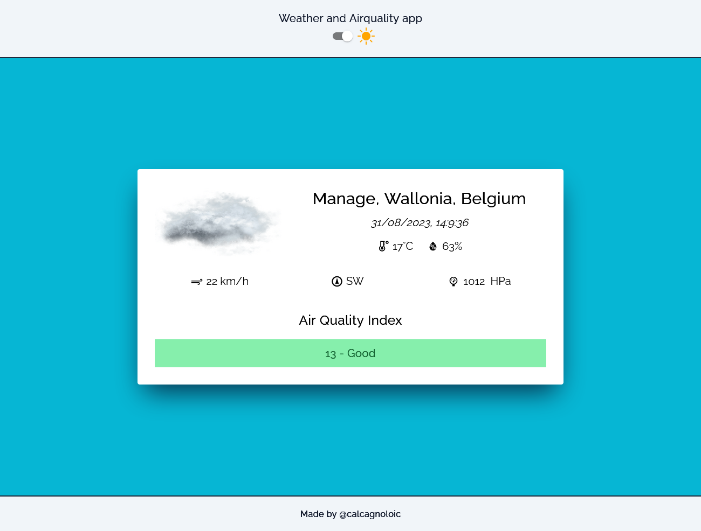

# Weather et airquality app

    
    
    

    

Application that displays the weather and air quality index using the [IQAir API](https://www.iqair.com/fr/).
The application displays temperature, humidity, wind speed and direction, and atmospheric pressure. The air quality index (American index) is also shown, along with its meaning and the appropriate colour code. 

## Versions

This first version of the application uses an API endpoint based on [IP address geolocation](https://api-docs.iqair.com/#376c20f8-b338-404b-851e-2ed244104ca5).

